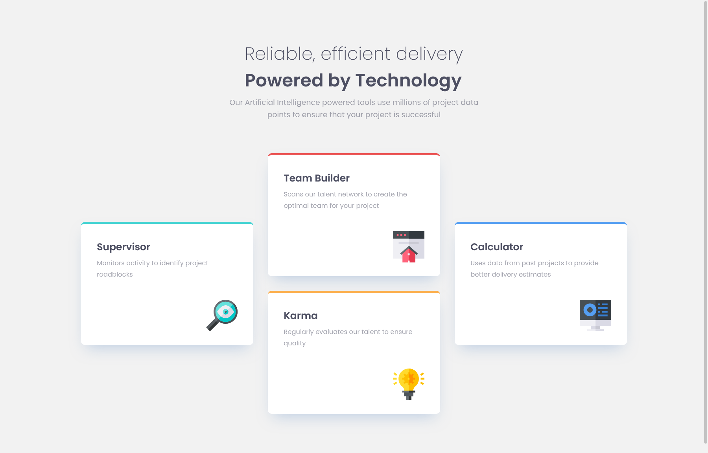

# Four card feature section solution
This is a solution to the [Four card feature section challenge on Frontend Mentor](https://www.frontendmentor.io/challenges/four-card-feature-section-weK1eFYK)

### The challenge
Users should be able to:
- View the optimal layout for the site depending on their device's screen size

### Screenshot

### Links
- Live Site URL: [Four card feature section](https://hamed3958.github.io/Four-card-feature-section/)

### Built with
- Semantic HTML5 markup
- CSS custom properties
- Flexbox

## Author
- Website - [hamedasadiasl.ir](http://hamedasadiasl.ir/)
- Github - [@hamed3958](https://github.com/hamed3958)
- Frontend Mentor - [@hamed3958](https://www.frontendmentor.io/profile/hamed3958)

